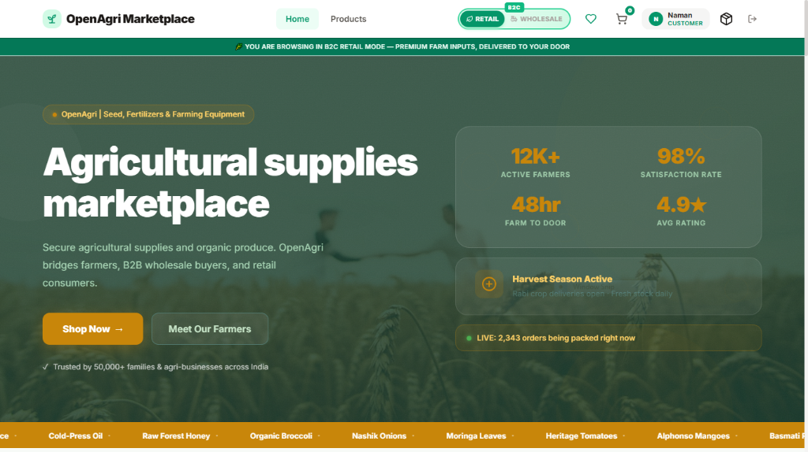
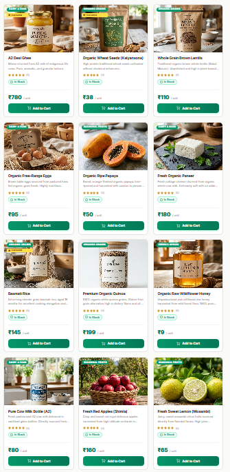
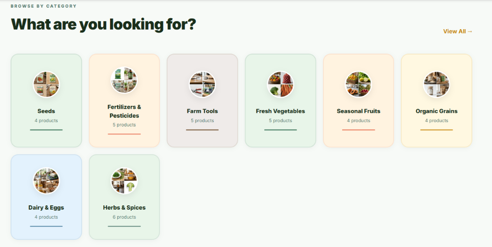
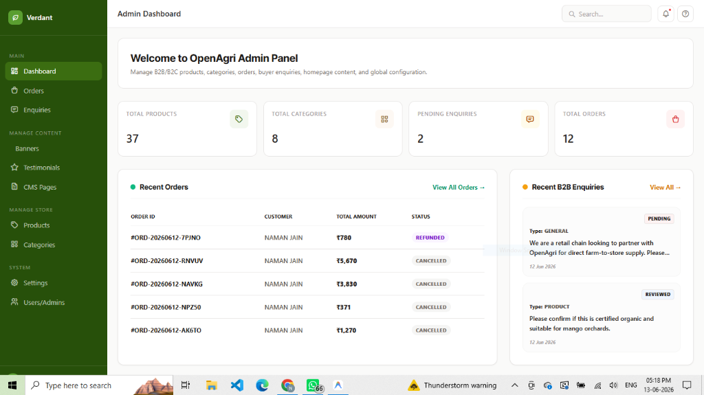
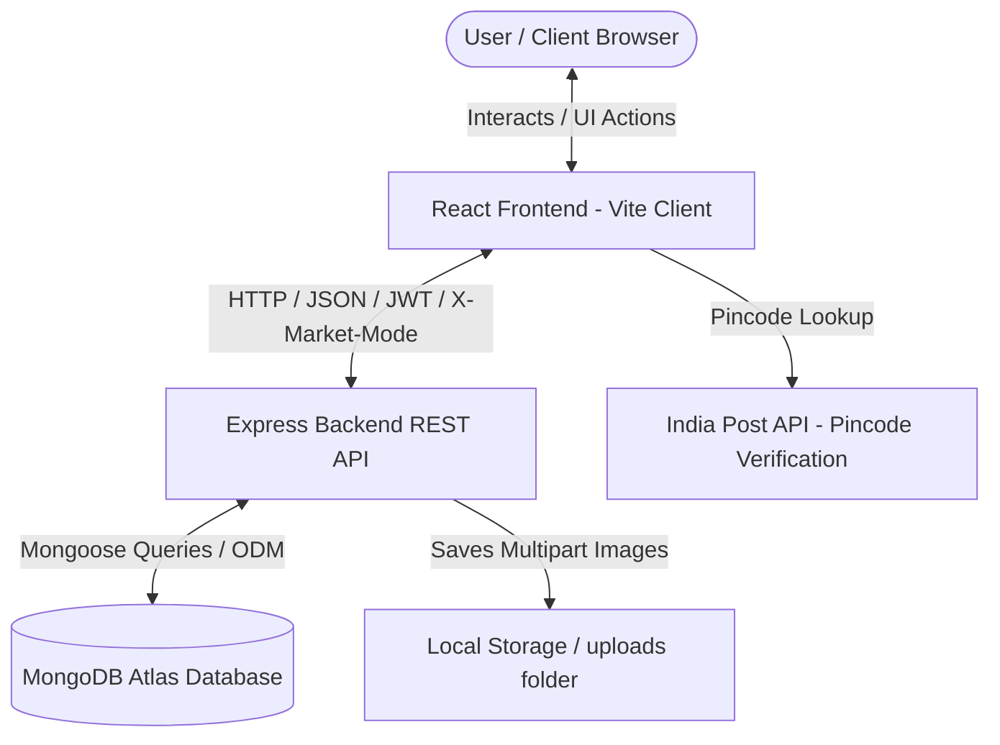

# OpenAgri — B2B & B2C Agricultural E-Commerce Marketplace

[](https://react.dev/)
[](https://nodejs.org/)
[](https://expressjs.com/)
[](https://www.mongodb.com/)
[](https://tailwindcss.com/)
[](https://vitejs.dev/)
[](https://turbo.build/)
[](https://opensource.org/licenses/MIT)

> **OpenAgri** is a production-ready, full-stack agricultural marketplace built with MongoDB, Express, React, and Node.js. It bridges Indian farmers, wholesale agricultural distributors, agribusinesses, and retail consumers through an authenticated, zero-middleman platform featuring real-time B2B/B2C mode toggling, dynamic tiered wholesale pricing, Request for Quotation (RFQ) workflows, live India Post pincode lookup, Amazon-style return tracking, and an extensive admin management suite.

---

## 📸 UI Showcase

| Storefront Homepage (Retail B2C Mode) | Product Catalog (Wholesale B2B Mode) |
| :---: | :---: |
|  |  |

| Browse Categories Grid | Admin Panel Dashboard & Real-time Alerts |
| :---: | :---: |
|  |  |

---

## 🚀 Live Demo & Deployment Links

* 🌐 **Customer Storefront:** [https://agriproject-frontend.vercel.app](https://agriproject-frontend.vercel.app)
* 🛡️ **Admin Dashboard:** [https://agriproject-frontend.vercel.app/admin](https://agriproject-frontend.vercel.app/admin)
* ⚡ **Backend REST API:** [https://agriproject-37n7.onrender.com/api](https://agriproject-37n7.onrender.com/api)

### 🔑 Seed Test Accounts

| Role | Email | Password | Access Scope |
| :--- | :--- | :--- | :--- |
| **Administrator** | `admin@openagri.com` | `password123` | Full access to Admin Dashboard, inventory, orders, CMS, and settings |
| **Customer** | `ramesh@patelfarms.com` | `password123` | Storefront browsing, cart, checkout, B2B wholesale quotes, and order tracking |

---

## ✨ Key Features

### 🛒 Dual Market Modes (B2C Retail & B2B Wholesale)
* **Instant Mode Switcher**: Single-click toggle between Retail (B2C) and Wholesale (B2B) with persistent state in `localStorage` and custom UI styling (Emerald theme for B2C, Amber theme for B2B).
* **Tiered Bulk Wholesale Pricing**: Automatic graduated volume discounts (e.g. 10+ units = 10% off, 50+ units = 25% off) with Minimum Order Quantity (MOQ) validation.
* **Request for Quotation (RFQ)**: Dedicated wholesale quote request engine for bulk institutional buyers with custom quantity, delivery timelines, and direct enquiry routing to admins.

### 📦 Customer Shopping & Checkout Experience
* **Amazon-Style Quantity Steppers**: Responsive inline quantity selectors (`- [x] in Cart +`) with typed-input limits and error boundaries across catalog cards, featured grids, product detail pages, and cart.
* **Verified Purchase Reviews**: 5-point star rating engine with custom vector SVG stars supporting fractional fills; review submissions are restricted to verified buyers.
* **India Post Pincode Auto-Resolution**: Real-time address auto-population for Indian states and districts via India Post API integration upon entering a 6-digit postal code.
* **Amazon-Style Return Stepper**: 4-stage visual return tracking progress bar (`Return Requested` ➔ `Picked Up` ➔ `Received at Hub` ➔ `Refund Processed`) with conditional inventory restock logic in MongoDB.
* **Live Order & Dispatch Ticker**: Dynamic homepage ticker showing real-time orders packed and dispatch trucks en route, computed directly from live database metrics.
* **Wishlist & Cart Management**: Instant badge counts, stock ceiling validations, and optimistic cart updates.

### 🛡️ Comprehensive Admin Management Suite
* **Real-time Bell Notifications**: Dynamic alerts for low-stock products, out-of-stock items, pending customer orders, and newly submitted B2B wholesale enquiries.
* **Product & Category CRUD**: Full lifecycle management with direct image uploads via Multer, pricing tiers configuration, and category re-ordering.
* **Order & Return Processing**: Manage order fulfillment statuses, process return lifecycles, and automate stock restorations.
* **Dynamic CMS Management**: Edit promotional slideshow banners, manage customer testimonials, configure platform settings, and edit static policy pages (About Us, Contact, Privacy Policy, Terms & Conditions, Shipping Policy, Return & Refund Policy, FAQs).
* **User Management**: View registered customers, administrators, contact details, and account creation dates.

---

## 🏗️ Architecture & Dataflow


```mermaid
graph TD
    User([User / Client Browser])
    Vite[React Frontend - Vite Client]
    Express[Express Backend REST API]
    Mongo[(MongoDB Atlas Database)]
    Pincode[India Post API - Pincode Verification]
    Uploads[Local Storage / uploads folder]
    
    User <--> |Interacts / UI Actions| Vite
    Vite <--> |HTTP / JSON / JWT / X-Market-Mode| Express
    Express <--> |Mongoose Queries / ODM| Mongo
    Vite --> |Pincode Lookup| Pincode
    Express --> |Saves Multipart Images| Uploads
```

### Key Workflows:
1. **Authentication & Session**: User submits credentials (`/api/auth/login`) ➔ Express validates with bcrypt and issues a signed JWT ➔ JWT stored in browser storage ➔ Axios interceptor injects `Authorization: Bearer <token>` and `X-Market-Mode` headers on all subsequent requests.
2. **Dynamic Pincode Lookup**: User enters a 6-digit Indian PIN on the checkout page ➔ Frontend fetches location metadata from the India Post API ➔ City and State dropdowns auto-populate with zero manual input required.
3. **Cart & Tiered Pricing**: Adding products under B2B mode automatically calculates tiered pricing based on purchase thresholds and validates that the order meets the product's Minimum Order Quantity (MOQ).
4. **Order Placement & Stock Decrement**: Placing an order atomically validates inventory and decrements stock quantities in the MongoDB `Product` collection.
5. **Return Lifecycle & Stock Restoration**: When an admin marks a return as `refunded`, the backend triggers automatic inventory restoration, incrementing product stock back in the database.

---

## 📡 REST API Reference

### 🔐 Authentication (`/api/auth`)
| Method | Endpoint | Description | Auth Required |
| :--- | :--- | :--- | :--- |
| `POST` | `/api/auth/register` | Register a new user account | No |
| `POST` | `/api/auth/login` | Login user & return JWT token | No |
| `GET` | `/api/auth/me` | Retrieve authenticated user profile | User / Admin |
| `GET` | `/api/auth/users` | List all registered users | Admin |

### 🌾 Products (`/api/products`)
| Method | Endpoint | Description | Auth Required |
| :--- | :--- | :--- | :--- |
| `GET` | `/api/products` | Fetch all products (supports search, category, sort) | No |
| `GET` | `/api/products/:id` | Fetch single product by ID or slug | No |
| `POST` | `/api/products` | Create a new product | Admin |
| `PUT` | `/api/products/:id` | Update an existing product | Admin |
| `DELETE` | `/api/products/:id` | Delete a product | Admin |
| `POST` | `/api/products/:id/reviews` | Submit product review & rating | Verified Buyer |

### 📂 Categories (`/api/categories`)
| Method | Endpoint | Description | Auth Required |
| :--- | :--- | :--- | :--- |
| `GET` | `/api/categories` | Fetch all product categories | No |
| `POST` | `/api/categories` | Create a new category | Admin |
| `PUT` | `/api/categories/:id` | Update category details | Admin |
| `DELETE` | `/api/categories/:id` | Delete a category | Admin |

### 📦 Orders (`/api/orders`)
| Method | Endpoint | Description | Auth Required |
| :--- | :--- | :--- | :--- |
| `POST` | `/api/orders` | Place a new order | User |
| `GET` | `/api/orders/my-orders` | Fetch orders for the logged-in customer | User |
| `GET` | `/api/orders` | Fetch all orders across the platform | Admin |
| `GET` | `/api/orders/:id` | Fetch single order details | User / Admin |
| `PUT` | `/api/orders/:id/status` | Update fulfillment or return status | Admin |
| `POST` | `/api/orders/:id/return` | Request return for a delivered order | User |

### 📝 B2B Enquiries & RFQ (`/api/enquiries`)
| Method | Endpoint | Description | Auth Required |
| :--- | :--- | :--- | :--- |
| `POST` | `/api/enquiries` | Submit wholesale quotation enquiry (RFQ) | User |
| `GET` | `/api/enquiries` | List all wholesale enquiries | Admin |
| `PUT` | `/api/enquiries/:id` | Update RFQ enquiry status | Admin |

### 🎨 CMS & Content (`/api/cms`)
| Method | Endpoint | Description | Auth Required |
| :--- | :--- | :--- | :--- |
| `GET` | `/api/cms/:pageType` | Fetch CMS page content (about, contact, privacy, etc.) | No |
| `PUT` | `/api/cms/:pageType` | Update CMS page content | Admin |
| `GET` | `/api/cms/banners/list` | Fetch homepage hero slideshow banners | No |
| `POST` | `/api/cms/banners` | Add new homepage promotional banner | Admin |
| `DELETE` | `/api/cms/banners/:id` | Remove promotional banner | Admin |

### ⚙️ Settings & Uploads (`/api/settings`, `/api/upload`)
| Method | Endpoint | Description | Auth Required |
| :--- | :--- | :--- | :--- |
| `GET` | `/api/settings` | Retrieve public marketplace settings & ticker stats | No |
| `PUT` | `/api/settings` | Update marketplace contact & operational settings | Admin |
| `POST` | `/api/upload` | Upload image file (multipart form data) | Admin |

---

## 💻 Tech Stack

### Frontend
* **Core Framework:** React 18 with Vite
* **Routing:** React Router DOM 6
* **HTTP Client:** Axios (with JWT and Market Mode interceptors)
* **Styling:** TailwindCSS 3 with Autoprefixer
* **Icons:** Lucide React & Tabler Icons

### Backend
* **Runtime:** Node.js (ES Modules)
* **Framework:** Express.js 4
* **Database & ODM:** MongoDB Atlas with Mongoose 8
* **Security & Auth:** JSON Web Tokens (JWT), bcryptjs, Helmet, CORS
* **File Uploads:** Multer with local disk storage / Cloudinary support
* **Logging:** Morgan

### Monorepo & Build Tooling
* **Orchestration:** Turborepo 2.0
* **Package Manager:** npm Workspaces

---

## 📁 Project Structure

```text
open-agri-mern/
├── apps/
│   ├── backend/                      # Express REST API Server
│   │   ├── src/
│   │   │   ├── config/               # Database connection (db.js)
│   │   │   ├── controllers/          # Request handlers for auth, products, orders, etc.
│   │   │   ├── middleware/           # Auth guard, admin check, error handler, upload
│   │   │   ├── models/               # Mongoose schemas (User, Product, Order, CMS, etc.)
│   │   │   ├── routes/               # API endpoint definitions
│   │   │   └── server.js             # Express application entrypoint
│   │   ├── uploads/                  # Uploaded product and category image files
│   │   ├── package.json
│   │   └── seed.js                   # Database seeder with sample data
│   │
│   └── frontend/                     # React 18 + Vite SPA
│       ├── public/                   # Static public assets
│       ├── src/
│       │   ├── assets/               # Local icons and artwork
│       │   ├── components/           # Reusable UI components (Navbar, Steppers, Modals)
│       │   ├── context/              # React Context providers (MarketContext, CartContext)
│       │   ├── hooks/                # Custom React hooks
│       │   ├── pages/                # Customer storefront and Admin dashboard pages
│       │   │   ├── admin/            # Admin sub-pages (Dashboard, Orders, Products, CMS)
│       │   │   ├── AgriHomepage.jsx  # Dynamic B2B/B2C homepage
│       │   │   ├── Products.jsx      # Filterable product catalog
│       │   │   ├── ProductDetail.jsx # Product specifications & reviews
│       │   │   ├── Checkout.jsx      # India Post pincode checkout form
│       │   │   └── MyOrders.jsx      # Order history & return stepper
│       │   ├── services/             # Axios API client & endpoints
│       │   ├── App.jsx               # Route definitions & layout wrappers
│       │   └── main.jsx              # React DOM render root
│       ├── package.json
│       ├── tailwind.config.js
│       └── vite.config.js
│
├── packages/
│   └── shared/                       # Shared constants & TypeScript/JS types
│       └── index.js                  # User roles, order statuses, market modes
│
├── screenshoot/                      # UI screenshots for documentation
├── .env.example                      # Example environment variables template
├── package.json                      # Monorepo root package.json
├── turbo.json                        # Turborepo task pipeline configuration
└── README.md                         # Project documentation
```

---

## 🛠️ Local Development Setup

### Prerequisites
* **Node.js**: `v18.0.0` or higher
* **npm**: `v9.0.0` or higher
* **MongoDB**: Local MongoDB instance or free [MongoDB Atlas Cluster](https://www.mongodb.com/atlas)

### 1. Clone the Repository
```bash
git clone https://github.com/namanraid65/agriproject.git
cd agriproject/open-agri-mern
```

### 2. Install Dependencies
Install all workspace dependencies from the root directory:
```bash
npm install
```

### 3. Configure Environment Variables
Create a `.env` file in `open-agri-mern/`:
```bash
cp .env.example .env
```

Configure your `.env` variables:
```env
# Backend Configuration
PORT=5002
MONGODB_URI=your_mongodb_connection_string
JWT_SECRET=your_super_secret_jwt_key
JWT_EXPIRES_IN=7d
CLIENT_URL=http://localhost:3002,http://localhost:5173

# Frontend Configuration
VITE_API_URL=http://localhost:5002/api
```

### 4. Seed the Database
Populate your database with sample categories, products, wholesale pricing tiers, test reviews, dynamic banners, and admin credentials:
```bash
npm run seed --workspace=apps/backend
```

### 5. Start Development Servers
Run both frontend and backend concurrently via Turborepo:
```bash
npm run dev
```

* **Frontend Application:** `http://localhost:3002`
* **Backend REST API:** `http://localhost:5002/api`

---

## ☁️ Deployment Guide

### Backend Deployment (Render.com)
1. Navigate to [Render Dashboard](https://dashboard.render.com/) ➔ **New Web Service**.
2. Connect your GitHub repository: `namanraid65/agriproject`.
3. Configure the service settings:
   * **Root Directory:** `open-agri-mern/apps/backend`
   * **Environment:** `Node`
   * **Build Command:** `npm install`
   * **Start Command:** `npm start`
4. Add the required Environment Variables:
   ```env
   NODE_ENV = production
   PORT = 5000
   MONGODB_URI = mongodb+srv://<user>:<password>@cluster.mongodb.net/agriproject
   JWT_SECRET = your_production_jwt_secret
   JWT_EXPIRES_IN = 7d
   CLIENT_URL = https://agriproject-frontend.vercel.app
   ```

### Frontend Deployment (Vercel)
1. Navigate to [Vercel Dashboard](https://vercel.com/dashboard) ➔ **Add New Project**.
2. Import the GitHub repository: `namanraid65/agriproject`.
3. Configure the project settings:
   * **Framework Preset:** `Vite`
   * **Root Directory:** `open-agri-mern/apps/frontend`
   * **Build Command:** `npm run build`
   * **Output Directory:** `dist`
4. Add the Environment Variable:
   ```env
   VITE_API_URL = https://agriproject-37n7.onrender.com/api
   ```
5. Click **Deploy**.

---

## 🤝 Contributing

Contributions are welcome! Please follow these steps:
1. Fork the repository.
2. Create your feature branch (`git checkout -b feature/AmazingFeature`).
3. Commit your changes (`git commit -m 'feat: add amazing feature'`).
4. Push to the branch (`git push origin feature/AmazingFeature`).
5. Open a Pull Request.

---

## 📄 License

Distributed under the **MIT License**. See `LICENSE` for more information.

---

<div align="center">
  <sub>Built with ❤️ for Indian Agriculture and Farmers &middot; OpenAgri Marketplace</sub>
</div>
